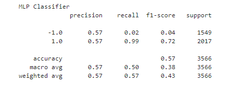

## Tuning_and_testing_trading
Creates a baseline trading algorithm based on Support Vector Machines. Attempts to optimize the trading algorithm by adjusting training size, parameters and training models. Creates a report as well as images of plots to showcase the differences in machine learning models and their effect on returns.

---

---

## Technologies

Language: Python 3.9.12

Libraries used:

[Pandas](https://pandas.pydata.org/pandas-docs/stable/index.html) - For the creation and visualization of Data Frames

[Jupyter Labs](https://jupyter.org/) - An ipython kernel for interactive computing in python

[PyViz hvPlot](https://hvplot.holoviz.org/index.html) - A high level python library for interactive data visualization

[Matplot Lib](https://matplotlib.org/) - Library used for creating plots and visualizations

[Scikit-Learn](https://scikit-learn.org/0.18/auto_examples/svm/plot_iris.html) - Powerful machine learning library

---

## Usage

Open up your gitbash terminal and navigate to the location of the program files and activate your dev environment, after doing so open up jupyter labs by typing jupyter lab in gitbash. then run the model and observe the report. Every model takes a slightly different paramater to try and get the most accurate answer.

## Overview of Project

## Baseline Model
This model aims to predict a signal to either buy or short a stock based on when returns are predicted to be negative or positive.

## SMA Periods Extended
This tuned version of the model uses a short SMA period of 30 and and longer period of 125 to try and predict the trading signal. This tests whether increasing or decreasing the SMA window has an effect on predictability.

## New Machine Learning Classifier
A Multi-Layer Perceptron Classifier model is used instead of the Support Vector Machines Classifier. This classifier is an easier way to incorporate a neural network model compared to creating your own dense layers using TensorFlow.

# Summary - Evaluation Report

## Baseline Model
 

Here we have the baseline model that has an accuracy score of 56% and strategy returns are less than the actual returns.

---
## Different Training Size
 

Here with a longer training period we have an accuracy score of 56% and a lower precision and f1 score than baseline. It has report scores very similar to the baseline although at one point it seems to almost out return the basline only to fall below once again.

##  New machine learning classifier
 

This model seems to outperform the basline model in everything except f1 score and the overall strategy returns seem to slightly outreturn the baseline.

## Conclusion
In conclusion based on the data from each strategy simply changing the classifier to the New Machine Learning Classifier seemed to have the greatest results. though i assume with more tests we could find an SMA window that fits with the new classifier and find an even better model.

## Contributors

Created by Austin Means while in the UW FinTech Bootcamp
> Contact Info:
> email: austinmeans92@gmail.com|
> 
> [GitHub] (https://github.com/aimeans) |